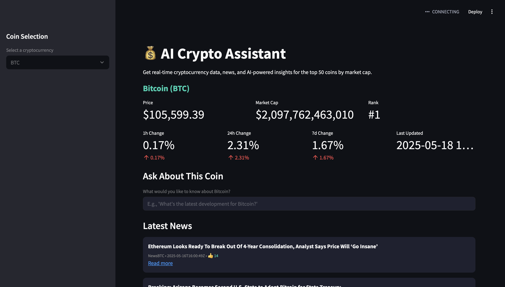

# AI Crypto Assistant

 

A Streamlit-powered web application that provides real-time cryptocurrency data, news, and AI-powered insights for the top  cryptocurrencies by market capitalization.

## Features

- 📊 Real-time cryptocurrency price data and metrics
- 📰 Latest crypto news aggregation
- 🤖 AI-powered insights using Ollama (Llama3)
- 📈 Market trends and price change indicators
- 🔍 Coin-specific information and analysis

## Prerequisites

Before you begin, ensure you have the following:

- Python 3.8+
- Ollama installed locally ([download here](https://ollama.ai/))
- API keys for:
  - [CoinMarketCap](https://coinmarketcap.com/api/)
  - [CryptoPanic](https://cryptopanic.com/developers/api/)

## Installation

1. Clone the repository:
   ```bash
   git clone https://github.com/estelif/blockchain4.git
   cd ai-crypto-assistant